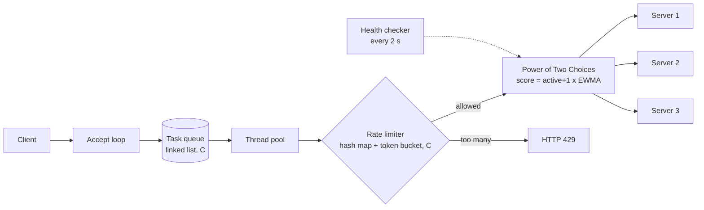

# Dynamic Load Balancer - Asynchronous HTTP API Gateway


**Team DSCPP-III-2026-T035** | Graphic Era (Deemed to be University), Dehradun
Team: Kunal Singh Sengar (Lead), Harvie Sharma, Aditya Rawat, Sachin Mishra | Mentor: Mr. Kireet Joshi

An HTTP API gateway written in **C++17** with all data structures written in **C**.
It sends each request to the backend server that can answer fastest *right now*, instead of using a fixed order like round-robin.

## It works - proof
- The green badge above and the **Actions** tab run the whole demo automatically on every push.
- Real output of that run (also saved in [`docs/demo_output.txt`](docs/demo_output.txt)):

<details open>
<summary><b>Demo output (click to collapse)</b></summary>

```text
Ready: http://127.0.0.1:10000   (live scores: http://127.0.0.1:10000/_stats)
== 1. Normal routing
20 requests:
      7 Server-1
      7 Server-2
      6 Server-3
  PASS: requests reach at least 2 different servers
== 2. Slow server (Server-3 made slow)
Making Server-3 slow (1.5 s); sending 40 requests ...
     20 Server-1
     19 Server-2
      1 Server-3
rank  server              healthy  active  ewma(ms)   score      served
1     127.0.0.1:8081      UP       0       0.1        1.0        27
2     127.0.0.1:8082      UP       0       0.2        1.0        26
3     127.0.0.1:8083      UP       0       1261.7     126.7      7
  PASS: Server-3 got <= 8 of 40 requests (traffic shifted away)
== 3. Failover (Server-2 stopped)
Stopping Server-2 ...
12 requests:
     12 Server-1
rank  server              healthy  active  ewma(ms)   score      served
1     127.0.0.1:8081      UP       0       0.1        1.0        39
2     127.0.0.1:8083      UP       0       1261.7     2.1        7
3     127.0.0.1:8082      DOWN     0       0.2        1.0        26
  PASS: no request went to the dead Server-2
  PASS: all 12 requests still succeeded
== 4. Recovery (Server-2 restarted)
20 requests:
      6 Server-1
      7 Server-2
      7 Server-3
  PASS: Server-2 serves traffic again
== 5. Rate limit
300 parallel requests (HTTP status codes):
    168 200
    132 429
  PASS: some requests were rejected with 429
  PASS: some requests succeeded with 200
ALL CHECKS PASSED
```
</details>

What the output shows:

| Scenario | Result |
|---|---|
| Normal routing | Requests are spread over all 3 servers |
| Slow server | Server-3 slowed to 1.5 s, so it received only about 1 of 40 requests |
| Failover | Server-2 stopped, all 12 requests still succeeded via other servers |
| Recovery | Server-2 restarted and returned to the pool |
| Rate limit | A burst of 300 parallel requests got a mix of 200 and 429 |

## Architecture



## Data structures used (all in C, folder `dsa/`)
| Data structure | Used for |
|---|---|
| Dynamic array | List of backend servers |
| Linked-list queue | Thread-pool task queue |
| Hash table (chaining, FNV-1a) | Rate limiter: client IP to token bucket |
| Min-heap | Ranking servers by score in `/_stats` |
| Token bucket | Per-client rate limiting |

Unit tests for all of them: `make test`.

## How the best server is chosen
1. **Health check** every 2 s on `/health`. Dead servers get no traffic and return automatically when they recover.
2. **Power of Two Choices**: pick two random healthy servers, send the request to the one with the lower score.
3. **Score** = `(active requests + 1) x EWMA latency`. Lower is better. A slow or busy server gets fewer requests.
4. **Failover**: if a server fails during a request, the gateway retries on another server (up to 3).

## Run it yourself (Linux / WSL / macOS / GitHub Codespaces)
Needs `gcc`, `g++`, `make`, `curl`.
```bash
make test                               # data structure unit tests
bash scripts/start_demo.sh              # 3 backends + gateway on :10000
bash scripts/demo_commands.sh normal    # also: slow, fast, failover, recover, burst, stats
bash scripts/ci_test.sh                 # full automatic check (what GitHub Actions runs)
bash scripts/stop_demo.sh
```
Live server ranking: `http://127.0.0.1:10000/_stats`

Gateway options: `./bin/gateway --port 10000 --backends host:port ... [--threads 16] [--rate 50] [--burst 100]`

## Project layout
```
dsa/        C data structures + unit tests
src/        gateway.cpp, backend.cpp, net.hpp (C++17)
scripts/    start/stop/demo commands and automatic test
.github/    GitHub Actions workflow
docs/       captured demo output
```

## Limitations and future work
- Only requests without a body (GET) are forwarded. POST body forwarding is planned.
- Thread-pool based with blocking I/O. An epoll-based fully asynchronous version is future work.
- Database storage of metrics (MySQL/PostgreSQL) is planned for Phase-II.
